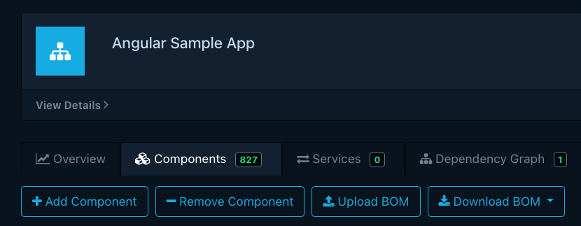

# Analyzing Project for Security vulnerabilities

## Preperation

1. Install [OWASP Dependency-Tracker](https://dependencytrack.org/):
```bash
> curl -LO https://dependencytrack.org/docker-compose.yml
> docker-compose up -d
```

2. Open the Frontend: `localhost:8080` and login with username: `admin` and password: `admin`
3. Add a Project with the name `Angular Sample App`
4. Clone following Test Repo: `https://github.com/martinakraus/spa_angular_hello-world_workshop` and install dependencies: `npm i`
5. Install cyclonedx to create a SBOM `npm i -g @cyclonedx/cyclonedx-npm`

## Task: Create Security Analysis:

1Create a SBOM with `cyclonedx-npm --output-file bom.json`
2Upload the created SBOM inside the dependency-tracker:

